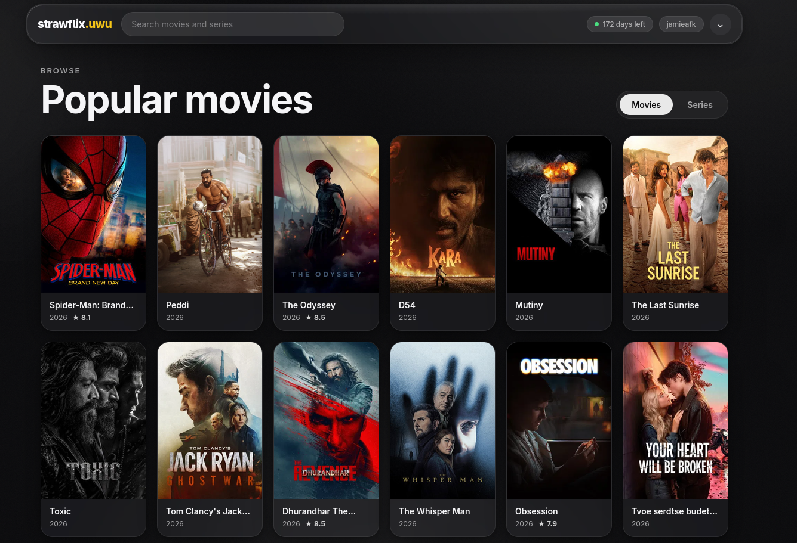

# Strawflix



> ⚠️ Only stream content you are legally entitled to watch. Your Real-Debrid token is stored only in your browser's `localStorage` and is sent to this app's own server routes to fetch stream metadata — it is never logged or exposed publicly.

## How it works

1. **Browse & search** — metadata comes from Cinemeta (Stremio's official metadata add-on); no API key needed. Catalogs and search are proxied through this app's server routes.
2. **Find a stream** — when you open a title, the app asks Torrentio (`torrentio.strem.fun`) with your Real-Debrid token configured as `realdebrid=<token>`, which returns cached, playable streams.
3. **Play** — streams go through `/api/proxy` **by default**, which pipes the video with Range/206 support, inline (non-download) headers, and CORS — so the browser plays instead of downloading. The player can switch to the **Direct link** (Torrentio → Real-Debrid redirect) if needed. Uncached (magnet) streams can be "Hosted to Debrid" with progress tracking.
4. **Resume watching** — watch position is saved to `localStorage` every few seconds (optionally synced to Vercel KV for cross-device resume). Come back to a movie or episode and the player resumes where you left off; the home screen shows a "Continue watching" section.
5. **My List** — star any movie/show (on cards or the title page) to build a watchlist that syncs across devices alongside your progress.
6. **Player toolkit** — next/previous episode (auto-plays via Torrentio binge support), ⏪/⏩ 10-second arrow-key seeks, `Space` pause, speed control (0.5–2×), fullscreen, Cast (Remote Playback API when your browser supports it), and subtitles from OpenSubtitles.com when `OS_API_KEY` is configured.
7. **More like this** — titles similar to what you're watching, from Cinemeta's recommendations endpoint.
8. **PWA** — installable, offline-ready app shell (manifest + service worker).

## Tech

- **Next.js 15** (App Router, Route Handlers for the server-side API work) — deploy-ready for Vercel.
- TypeScript, no external UI libraries. Pure CSS design system in `app/globals.css`.
- Server routes: `/api/catalog`, `/api/meta`, `/api/streams`, `/api/token`, `/api/magnet`, `/api/magnet/status`, `/api/proxy`, `/api/progress`, `/api/watchlist`, `/api/similar`, `/api/subtitles`, `/api/subtitle`.

## Run locally

```bash
npm install
npm run dev
```

Open http://localhost:3000, paste your API token from https://real-debrid.com/apitoken, and search.

## Deploy to Vercel

```bash
npm i -g vercel
vercel        # or: vercel --prod
```

Connect your account, accept the defaults (Vercel auto-detects Next.js), and you're live. No environment variables are required.

### Optional environment variables

| Variable | Purpose |
| --- | --- |
| `TORRENTIO_BASE` | Override the Torrentio instance (e.g. a self-hosted one). Defaults to `https://torrentio.strem.fun`. |
| `KV_REST_API_URL` | Enables **cross-device watch progress + My List**. Set both this and the token below to sync across devices via Vercel KV. |
| `KV_REST_API_TOKEN` | Vercel KV REST API token (paired with the URL above). |
| `OS_API_KEY` | Enables **subtitles** via OpenSubtitles.com. Pair with `OS_USERNAME`/`OS_PASSWORD` (a free account). |
| `OS_USERNAME` | OpenSubtitles.com username. |
| `OS_PASSWORD` | OpenSubtitles.com password. |
| `OS_LANGUAGES` | Subtitle languages to fetch (default `en`). Comma-separated, e.g. `en,es`. |
| `EXTRA_ADDONS` | Extra stream source add-ons (Stremio protocol). JSON array: `[{"base":"https://addon.example","config":"realdebrid={token}","label":"MyAddon"}]`. `{token}` is replaced with the user's token per request. |

Without `KV_REST_API_URL`/`KV_REST_API_TOKEN`, progress and My List are kept in the browser's `localStorage` only. To add sync: in Vercel, create a **KV store** (Storage → KV → Create Database), then paste its `.env.local` values (`KV_REST_API_URL` and `KV_REST_API_TOKEN`) into your project's Environment Variables and redeploy. Progress is keyed by a hash of your Real-Debrid token, so the same account resumes mid-scene on any device.

## FAQ

- **Why not expose my token publicly?** The token is embedded in Torrentio URLs (that's how Torrentio's config works), and those URLs are generated server-side on each request. Never share a stream URL you've copied from the network tab.
- **Streams stuck buffering?** Switch the player to **Direct link**, or pick a cached (⚡ Instant) stream.
- **Stream downloads instead of playing?** Make sure **Proxy mode** is on (it is by default). If it's still downloading, the source is likely an MKV file, which browsers can't play — pick an MP4/WebM stream instead.
- **Video plays but no audio?** The file's audio track is AC3/DTS/EAC3, which browsers can't decode. Pick a different release (an MP4 with AAC audio) — the stream list marks each file's container to help you choose.
- **Movies don't start?** The player first tries the proxy, then auto-retries on the direct link, then shows a detailed error. Releases labeled **MP4** are the most reliable; **MKV** streams commonly fail in browsers.
- **No streams?** Real-Debrid Premium is required. Confirm your token is active under https://real-debrid.com/account.
